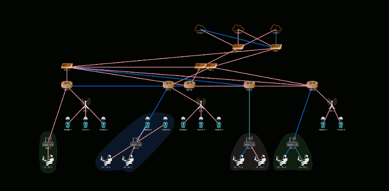

This tool is for color inversing of a batch of images. Generated files will be found in folder "gen" under working directory. The name of a generated file will be the same as the original one.

 

Usage: 

 - if there's no parameter, all image files under working directory will be inversed.

 - otherwise, each image file in parameters will be inversed.

 

Run:

 - **maven**

 1. `mvn package`

 2. `java -jar target/InverseColor-1.0.0.jar [optional: image files]`

 or

 - **gradle**

 1. `gradle jar`

 2. `java -jar build/libs/InverseColor.jar [optional: image files]`

 
 - original image

 

 - inversed image

 

